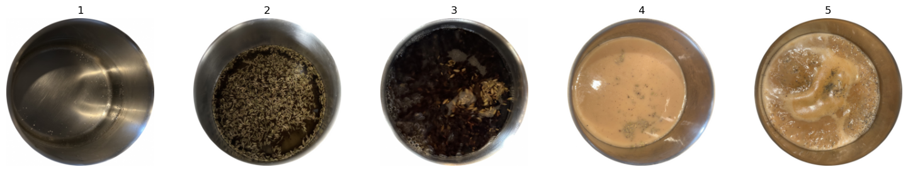
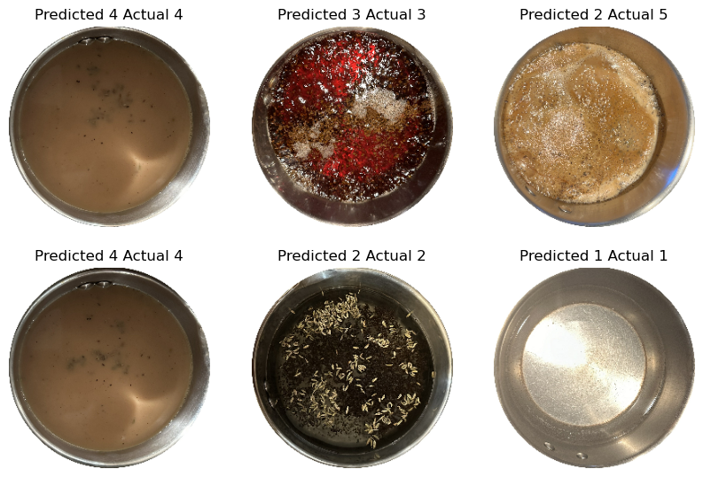

### Use Image classification to detect steps in making Chai(Indian Milk Tea) 

**Pulkit Bhanot**

#### Executive summary
Through the use of Image classification techniques, we can effectively differentiate between
different phases in the preparation of food items. This provides an opportunity to build solutions 
for a vast but untapped food preparation market segment. 

We look into entering this market with categorizing of different steps in the process of making Tea, which according to 
[Statista](https://www.statista.com/statistics/940102/global-tea-consumption/#:~:text=In%202022%2C%20global%20consumption%20of,7.4%20billion%20kilograms%20by%202025.&text=Tea%20is%20the%20second%20most,in%20the%20world%2C%20after%20water.) 
is the second most consumed drink in the world after water. Within Tea segment we will look into deploying image 
classification for categorizing different steps in the process of making Chai(a.k.a Indian Milk Tea) which is one of the
most popularly consumed variety of Tea with more than 80% of the households in India preferring the same( [source](https://www.teaboard.gov.in/pdf/Executive_Summary_Tea_Consumption_20062018_pdf5940.pdf) ). 

The initial solution would target 2 sets of customers; gourmet users who want the tea to be made precisely in a 
predefined way to ensure the perfection in the taste and multi-taskers/environmentalist who tend to get busy between 
cooking and other tasks and end up with either half-cooked food or wasting resources in overcooking.  

The solution itself would be to train an image classification model to classify images of the different stages in the 
process of making the item, in this case Tea. We will then deploy this model in an Android app. In the first phase the 
user will be able to take a photo which will get evaluated by the model and classified into an appropriate phase. In a 
later phase we will explore the option of running the model over a live video stream and use some form of audio 
notification to denote when the time is appropriate to move the next stage.

#### Rationale
One big reason is global warming, and the other one being to avoid food wastage. Though cooking inefficiencies might not 
be among the top 10 contributor of the greenhouse gases, nevertheless we need to make all efforts to reduce greenhouse gases 
wherever possible. Another aspect is that I am a tea lover myself and I feel instead of standing in front of a stove waiting 
for the preparation to progress through different stages, I can better utilize the same time.

#### Research Question
Use AI(Image Detection) to drive energy efficiencies in the Kitchen. Specific problem is to use image classification for 
the different stages of Chai(Indian Milk Tea).

#### Data Sources
I have manually captured the images for the different stages of making the tea over several days. 
And have manually classified the different sets of images based on what stage of preparation they are a part of. 

The dataset is a set of 162 images of the 5 stages in the process of tea making. 

Images are precategorized and stored in 5 folders 

<pre>
├── 1
│   ├── 1.jpg
│   ├── 10.jpg
│   ├── 125.jpg
│   ├── 132.jpg
...
├── 2
│   ├── 102.jpg
│   ├── 103.jpg
│   ├── 109.jpg
...

├── 3
│   ├── 100.jpg
│   ├── 101.jpg
│   ├── 104.jpg
...
├── 4
│   ├── 106.jpg
│   ├── 107.jpg
│   ├── 108.jpg
...
└── 5
    ├── 105.jpg
    ├── 121.jpg
    ├── 124.jpg
...
</pre>

There are also some images in the directory [data/unclassified](./data/unclassified) which are used as a validation set.

#### Methodology
I will be training multiple scikit models starting with KNeighborsClassifier, SVC including performing GridSearch 
over gray scale and RGB images to find the model with highest accuracy. I will also perform Multiclass classification 
using Keras and Tensorflow. The resulting model I will embed in an app to make predictions on real time captured images.

#### Results
What did your research find?
Deep Learning(DL) models trained using Tensorflow and Keras were able to achieve a higher accuracy then other image 
classification models. Also DL models without dropout was able to achieve the highest accuracy for train/test dataset. 
This does seem to align with the fact that the model overfitted to the provided datasets. 

I was also able to embed the model into an Android app and was able to invoke model on the real time images taken from the camera.

Similar analysis support was also added for live video capture. An illustration of the live recording feature is shown below 

There are more detailed recordings for the predictions on the live recording for the different steps in [README_APP](./README_APP.md) file for the android app.

#### Next steps
What suggestions do you have for next steps?
We need to collect more image samples to achieve better accuracy of the resulting model. For the analysis I used 220x220
pixel images. We can train the model with larger image sizes to validate if larger sizes can result in higher model accuracy.
For image classification in DL, there are techniques to generate dataset like ImageDataGenerator, we can use this to augment 
the image dataset and explore if this would result in better model accuracy. We can also train the model with different 
classes of images belonging to preperation steps for different dishes to make it more general purpose image classifier for cooking.

#### Outline of project

- [Link to notebook with the analysis ](./capstone.ipynb)
- [Link to categorized images of the dataset](./data/classes/)
- [Link to model](./assets/model.tflite)
- [DL model layers](./images/model.tflite.png)
- [Link to android app](./android)

##### Contact and Further Information
Please reach out pulkit.bhanot@gmail.com for any questions.

##### References
While preparing this project, I used the following references.

- https://nbviewer.org/github/quickgrid/CodeLab/blob/master/tensorflow/TFlite_Object_Detection_Custom_Model_Export_With_Metadata_TF1.ipynb
- https://www.tensorflow.org/api_docs/python/tf/keras/preprocessing/image/ImageDataGenerator
- https://learnopencv.com/histogram-of-oriented-gradients/
- https://kapernikov.com/tutorial-image-classification-with-scikit-learn/
- https://github.com/IJ-Apps/Image-Classification-App-with-Custom-TensorFlow-Model
- https://developer.android.com/codelabs/camerax-getting-started#0
- https://www.geeksforgeeks.org/choose-optimal-number-of-epochs-to-train-a-neural-network-in-keras/
- Various articles on https://www.tensorflow.org/tutorials

