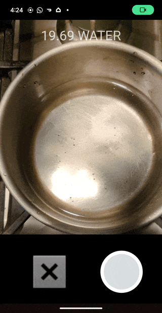

### Android App details

Android app deploys a tensorflow model where the input is a RGB image of size 250x250. It can make predictions in one of the 3 ways.
- Take a real time picture and predict which class the image belongs to.
- Upload an already saved image from the gallery and predict the class for the image.
- Do image classification on a live stream of video being viewed on a screen.

### Classification Results
Following are the gif image representation of the different flow.
#### For Image 
Classification on images captured real time from the phone camera.

### For videos
Classification of videos from the live camera feed.

#### Recoding of step1, i.e pan with water

#### Recording of step2, water with tea leaves.

#### Recording of Step 3, boiling water containing tea leaves

#### Recording of Step 4, tea with milk just added

#### Recording of Step 5, tea is ready to be taken off the burner

