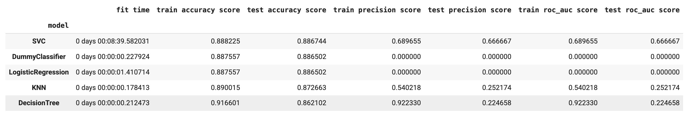
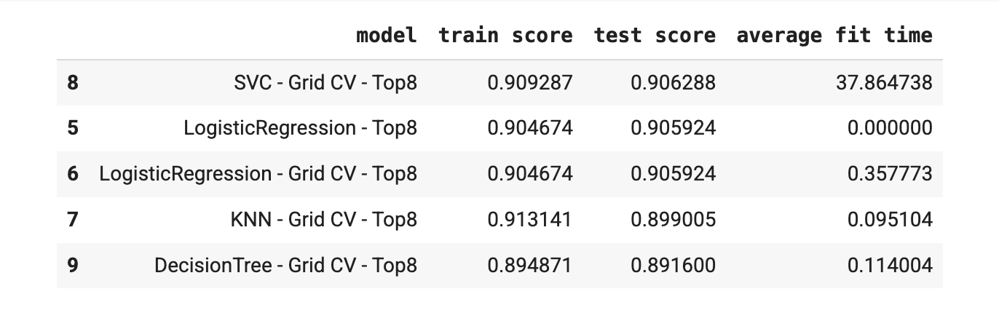

# Factors determining if a Client will Subscribe to Term Deposit

investopedia.com defines a term deposit as a fixed-term investment that includes the deposit of money into an account at a financial institution.
This project aims to explore different Classification models and different model metrics to classify if a client is going to subscribe for a term deposit. 
The used dataset is from a bank's [marketing campaign](https://archive.ics.uci.edu/dataset/222/bank+marketing) contains information on 41187 clients which is available in the data folder as [bank-additional-full.csv](./data/bank-additional-full.csv]).

## Features

The dataset contains multiple numericals and categorical features. 

Feature name | DataType | Category | Unique values
--- | --- | --- | ---  
age | Int64 | Numerical| 78
job | string | Categorical | 12
marital | string | Categorical | 4
education | string | Categorical | 8
default | string | Categorical | 3
housing | string | Categorical | 3
loan | string | Categorical | 3
contact | string | Categorical | 2
month | string | Categorical | 10
day_of_week | string | Categorical | 5
duration | Int64 | Numerical| 1544
campaign | Int64 | Numerical| 42
pdays | Int64 | Numerical| 27
previous | Int64 | Numerical| 8
poutcome  | string | Categorical | 3
emp.var.rate | Float64 | Numerical | 10
cons.price.idx | Float64 | Numerical | 26
cons.conf.idx | Float64 | Numerical | 26
euribor3m | Float64 | Numerical | 316
nr.employed | Float64 | Numerical | 11

Outcome y is categorical with 2 values 'no' and 'yes'

## Business Understanding

The Objective is to use the provided dataset and identify a model and a measure for the qualiuty of the model. The goal for the model is to predict whether a client will subscribe for a term deposit based on various features like age, balance, duration, job, marital, education, default, housing, loan, contact, month, day_of_week, poutcome. This analysis can be used by banks in the same region to do similar market campaigns.

## Analysis 
### Initial Analysis for baseline model

Initial analysis was done by using the first 7 features  age , job , marital , education , default , housing and loan. We used column transformer and one hot encoding for categorical features. 

To get a baseline, we created a dummy classifier with the strategy of most_frequent. Accuracy score on train and test data came out to be 0.8876 and 0.8865. Confusion matrix for this classifier can be seen below. 

### Explore Different classification models

After knowing the baseline, we train 4 different models LogisticRegression, KNeighborsClassifier, SVC and DecisionTreeClassifier. Compare the different scores precision_score,accuracy_score,recall_score and roc_auc_score.

### Grid Search over classification models with all features

We use Grid search over the 4 models to optimize them and find the best accuracy scores.

### Grid Search over classification models with top 8 features
 
We used OrdinalEncoder and correlation to find the top 8 features. Heatmap for the correlation is below

We also use SequentialFeatureSelector with an estimator of LogisticRegression to find the top 8 features. These features came out to be ['age', 'marital', 'education', 'loan', 'day_of_week', 'duration',
       'pdays', 'poutcome']

We then use these features and grid search to find the accuracy score for the different models. 

## Summary

### Technical Analysis

- We explored different metrics(accuracy_score,roc_auc_score, precision_score, recall_score) for evaluation of these models.

- SVC outperformed other models over the choosen metric(accuracy) with score > .90 on both test an train dataset.

- Accuracy score differed by ~1% between SVC model with all features vs top 8 features. Hence if we have to opt for a less complex model with potentialy low computation latency an 8 feature model can perform almost as good as a model with all features.

- Hyperparameters for the same model across different split of features were same.

### Business Analysis
- Using a subset of 8 features ('age', 'marital', 'education', 'loan', 'day_of_week', 'duration', 'pdays', 'poutcome') we are able to accurately predict in 91% of the cases that a client will subscribe for term deposit.
- Using all the features a client subscription accuracy score was 91.1%.

## Artifacts

Notebook for the assignment can be referenced at [problem_II.ipynb](./prompt_III.ipynb). 

## Appendix

Any additional information goes here

- https://contrib.scikit-learn.org/category_encoders/ordinal.html
- Numerous stack overflow questions.
- https://seaborn.pydata.org/index.html